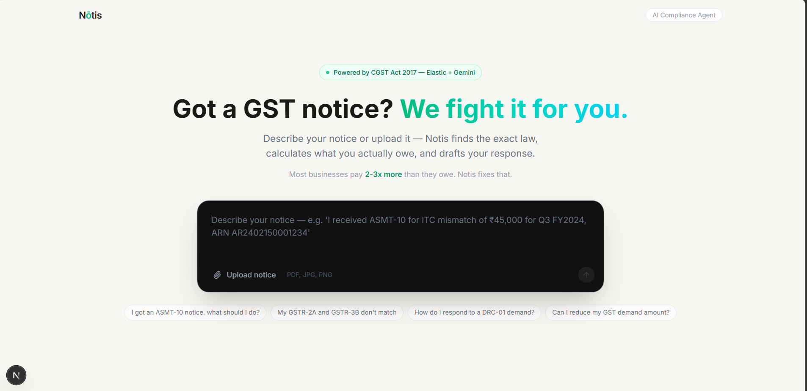
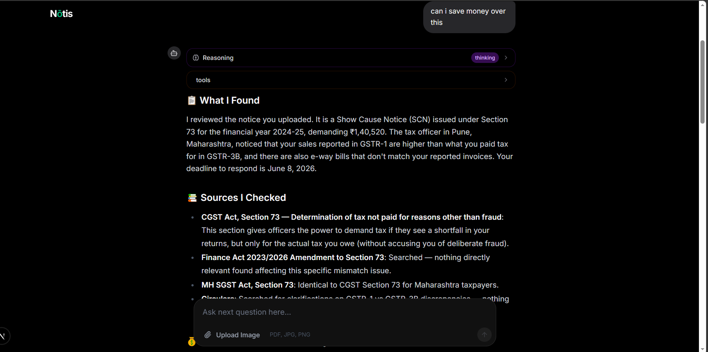

# Nōtis — AI GST Compliance Agent

> **60 million small businesses in India receive GST notices every year. Nōtis gives them a CA in their pocket, for free.**



---

## 📌 The Problem

India has over 60 million GST-registered small businesses. Every one of them receives notices — show cause notices, demand notices, ITC mismatch notices — and most owners have no idea what to do.

Their options:

- Pay a CA ₹5,000–₹10,000 (USD 50–100) **per notice** to draft a reply
- Ignore the notice and face automatic penalties

GST law is not simple. It has:

- **Central GST Act (CGST)** — 174 sections of base law
- **Finance Act amendments** — 2023 and 2026 changed key sections on ITC, penalties, and assessments
- **State GST Acts (SGST)** — each of India's 28 states has its own act with additional provisions
- **CBIC Circulars** — new practical guidance issued regularly that overrides how sections are enforced

A simple AI wrapper won't work — it will hallucinate legal citations, miss amendments, and ignore state-specific rules. A wrong citation in a response letter costs real money.

---

## 💡 What Nōtis Does

Upload a GST notice (image or PDF) or describe your situation in plain language. Nōtis:

1. **Reads the notice** — extracts notice type, ARN number, GSTIN, demand amount, due date, sections cited
2. **Searches real legal sources** — CGST Act 2017, Finance Act 2023 & 2026 amendments, CBIC circulars, state SGST acts
3. **Drafts a ready-to-send response letter** — with proper legal citations, correct section references, documents to attach
4. **Finds savings opportunities** — unclaimed ITC, penalty reductions, incorrect demand amounts, deadline extensions
5. **Explains everything in plain language** — so the business owner understands what happened and what to do



---

## 🏗️ Architecture


```
User (notice upload / chat)
        │
        ▼
  Gemini 3 Agent  ──── MCP ────▶  Elasticsearch
  (thinking +                      ├── search_cgst_act
   routing)                        ├── search_amendments
        │                          ├── search_circulars
        ├──────────────────────▶   └── search_sgst_act
        │                       MongoDB
        │                          ├── get_case
        │                          ├── update_case_status
        │                          └── save_draft_response
        ├──────────────────────▶  Analyze File
        │                         (image/PDF extraction)
        └──────────────────────▶  Ask User
                                  (clarifying questions)
```

### Tech Stack

| Layer       | Technology                              |
| ----------- | --------------------------------------- |
| AI Agent    | Gemini 3 via Google Cloud Agent Builder |
| Search      | Elasticsearch (Elastic Cloud)           |
| Agent Tools | Elastic Agent Builder MCP Server        |
| Database    | MongoDB Atlas                           |
| Backend     | Node.js, Express, TypeScript, Bun       |
| Frontend    | Next.js, Tailwind CSS                   |
| Streaming   | Server-Sent Events (SSE)                |

---

## 🔍 Why Elasticsearch

GST compliance is fundamentally a **search problem**:

- **174 sections** in the CGST Act alone
- **Finance Act amendments** changed Section 16, 73, 74 and penalty provisions in 2023 and 2026
- **State acts** add provisions on top of central law
- **CBIC Circulars** clarify enforcement — a circular can override how a section is applied

Every answer must be grounded in retrieved documents — not AI memory. A wrong legal citation costs real money.

**Elastic Agent Builder MCP** made this possible without building a custom RAG pipeline. The agent calls `search_cgst_act`, `search_amendments`, `search_circulars`, and `search_sgst_act` as natural tool calls during reasoning. Elasticsearch handles the retrieval; Gemini handles the legal reasoning.

---

## 📚 Legal Knowledge Base

Documents indexed into Elasticsearch across 7 indices:

| Index                 | Content                          |
| --------------------- | -------------------------------- |
| `gst-cgst-2017`       | CGST Act 2017 — all 174 sections |
| `gst-amendments-2023` | Finance Act 2023 amendments      |
| `gst-amendments-2026` | Finance Act 2026 amendments      |
| `gst-circulars`       | CBIC Circulars 187 & 188 (2022)  |
| `gst-sgst-mh`         | Maharashtra SGST Act             |
| `gst-sgst-ka`         | Karnataka SGST Act               |
| `gst-sgst-dl`         | Delhi SGST Act                   |

All PDFs were parsed using a Gemini-powered pipeline that extracts sections with structured metadata — section number, chapter, notice types, keywords, category — before indexing.

---

## 🤖 Mandatory Research Protocol

Before answering any query, the agent follows this exact sequence:

```
1. analyze_file      → extract notice details from uploaded document
2. search_cgst_act   → find base law sections
3. search_amendments → check if sections were updated in 2023 or 2026
4. search_sgst_act   → check state-specific provisions (if GSTIN state is MH/KA/DL)
5. search_circulars  → find practical enforcement guidance
6. synthesize        → compile findings and respond with citations
```

Every response includes:

- **Sources checked** — exactly which section and circular was found
- **Savings opportunities** — ITC, penalty reduction, deadline extensions
- **Action items** — what to do and by when
- **Draft response letter** — ready to send with legal citations
- **Plain English summary** — no jargon

---

## 🚀 Getting Started

### Prerequisites

- Bun or Node.js 18+
- MongoDB Atlas account
- Elastic Cloud account
- Google AI API key (Gemini 3)

### Environment Variables

**Backend `.env`:**

```env
MONGODB_URI=your_mongodb_connection_string
ELASTIC_URL=https://your-cluster.es.elastic-cloud.com
ELASTIC_API_KEY=your_elastic_api_key
KIBANA_URL=https://your-cluster.kb.elastic-cloud.com
GEMINI_API_KEY=your_gemini_api_key
PORT=3001
```

**Frontend `.env.local`:**

```env
NEXT_PUBLIC_SERVER_URL=http://localhost:3001/api
```

### Installation

```bash
# Clone the repo
git clone https://github.com/yourname/notis
cd notis

# Install backend dependencies
cd backend
bun install

# Install frontend dependencies
cd ../frontend
bun install
```

### Run Locally

```bash
# Backend
cd backend
bun run dev

# Frontend (separate terminal)
cd frontend
bun run dev
```

### Index Legal Documents

```bash
cd backend
# Add your PDF files to backend/data/
# Run the parser
bun run data/parse.ts
```

---

## 📁 Project Structure

```
notis/
├── backend/
│   ├── src/
│   │   ├── agent/
│   │   │   ├── orchestrator.ts   # Main agentic loop
│   │   │   ├── tools.ts          # Tool registry
│   │   │   ├── mcp.ts            # Elastic MCP client
│   │   │   └── prompt.ts         # System prompt
│   │   ├── utils/
│   │   │   └── db/
│   │   │       ├── mongo.ts
│   │   │       └── mongoTools.ts # MongoDB tool functions
│   │   ├── types.ts
│   │   └── index.ts              # Express server
│   └── data/
│       └── parse.ts              # PDF parsing + indexing pipeline
└── frontend/
    ├── app/
    │   ├── page.tsx              # Home page
    │   └── case/[caseId]/
    │       └── page.tsx          # Chat page
    ├── components/
    │   ├── ChatPage.tsx          # Chat interface
    │   └── ChatBox.tsx           # Message renderer
    └── store/
        └── useCaseStore.ts       # Zustand global store
```

---

## 🔮 What's Next

- **GSTIN-based automatic context fetch** — pull actual filing history (GSTR-1, GSTR-3B, GSTR-2A) directly from the GST portal using the user's GSTIN, so the agent already knows their tax position before they ask
- **Pre-emptive return health check** — analyze current returns to catch ITC mismatches and filing errors before the department does
- **All 28 state SGST acts** — currently supporting Maharashtra, Karnataka, and Delhi
- **Vernacular language support** — Hindi and regional languages for small business owners
- **Deadline tracking with reminders** — automatic alerts before notice response deadlines
- **GSTR return file analysis** — upload a return file and get a full audit before filing

---

## 📄 License

MIT License — see [LICENSE](./LICENSE.md)

---

## 🏆 Built for

[Google Cloud Rapid Agent Hackathon](https://rapid-agent.devpost.com/?ref_feature=challenge&ref_medium=your-open-hackathons&ref_content=Submissions+open&_gl=1*17uj4im*_gcl_au*MTUyNDE0ODgxMy4xNzgwMTA1NDQ0*_ga*MTQyODI0NTU2MC4xNzgwMTA1NDQ0*_ga_0YHJK3Y10M*czE3ODAxNDg2MjAkbzQkZzAkdDE3ODAxNDg2MjAkajYwJGwwJGgw) — Elastic Partner Track

Built with ❤️ to help Indian small businesses fight back against GST notices.
